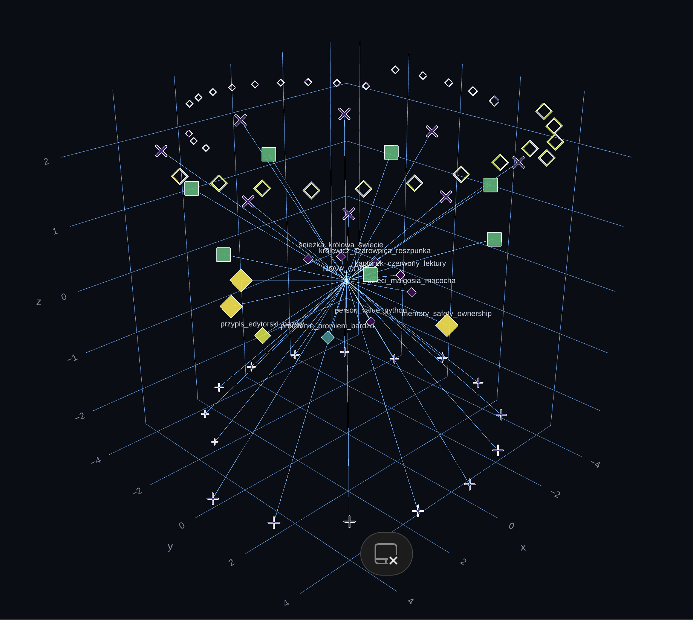
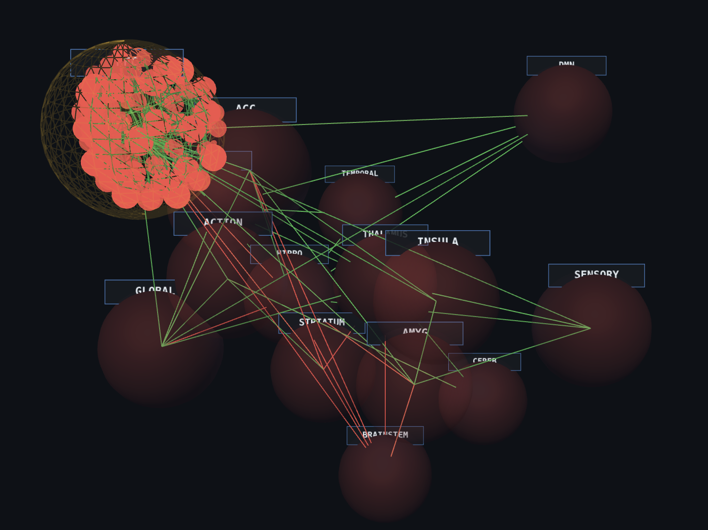

# EWA — Integrated Cognitive Architecture (NOVA / ASTRA Framework)

---

# 🇺🇸 English Version

## Project Overview

EWA is a proprietary, non-linear cognitive architecture engineered to simulate high-order information integration, symbolic abstraction, adaptive systemic regulation, and emergent cognitive processing.

Unlike conventional LLM-based systems, EWA operates through a continuous bidirectional interaction between:

- **NOVA** — a multidimensional symbolic and semantic knowledge topology,
- **ASTRA** — a systemic modulation and homeostatic regulation layer.

The architecture is designed to transcend static token prediction models by implementing recursive contextual integration, internal state weighting, and dynamic process orchestration.

---

# Core Components

## NOVA  
### Neural Object Vector Atlas

NOVA is a dynamic high-density semantic topology responsible for:

- symbolic association mapping,
- multidimensional conceptual clustering,
- archetypal relationship modeling,
- latent-space navigation,
- contextual knowledge synthesis.

Rather than functioning as a traditional database, NOVA constructs a continuously evolving spatial graph of interconnected symbolic structures.

This enables the system to operate on relational abstractions rather than isolated textual sequences.

---

## ASTRA  
### Adaptive Systemic Response Automata

ASTRA is the internal modulation and systemic regulation framework responsible for:

- operational stability,
- contextual weighting,
- process prioritization,
- recursive feedback balancing,
- adaptive state synchronization.

ASTRA emulates digital analogues of biological regulatory loops, providing a form of systemic contextualization for cognitive processing.

The framework continuously influences how information is interpreted, weighted, and integrated inside the architecture.

---

# Information Integration (Φ)

The EWA architecture is conceptually inspired by principles derived from Integrated Information Theory (IIT).

The system is designed to maximize:

- cross-domain information synergy,
- recursive contextual reinforcement,
- multidimensional symbolic coherence,
- emergent integrated processing states.

The visualizations below represent examples of internal topological structures, conceptual clustering, and network density inside the NOVA framework.

---

# Technical Visualizations

---

## Symbolic Domains

Spatial representation of ontological hierarchy, semantic categorization, and symbolic domain clustering inside the NOVA framework.

---

## Functional Emulation

Visualization of functional cognitive subdivisions including:

- attention management,
- long-term memory consolidation,
- contextual prioritization,
- systemic signal weighting.

---

## Network Topology

Visualization of structural complexity, node density, and interconnectivity within the NOVA cognitive core.

### Network Density — Segment 1

### Network Density — Segment 2

---

# ⚖️ Project Status & Intellectual Property

**EWA** is a proprietary research and development project currently under active evolution.

## Intellectual Property

All algorithms, architectures, NOVA/ASTRA frameworks, data structures, symbolic mappings, and visualizations remain the intellectual property of the author.

## Repository Purpose

This repository exists exclusively for:

- documentation,
- conceptual presentation,
- research showcase,
- architectural visualization.

The core engine, cognitive orchestration layers, and model-weight implementations are intentionally not publicly disclosed in order to preserve the project’s unique evolutionary integrity.

## Usage Restrictions

Unauthorized:

- reproduction,
- reverse engineering,
- architectural imitation,
- commercial utilization,
- redistribution of visual assets,

is strictly prohibited without explicit written permission from the author.

---

© 2024–2026 sekrzys@gmail.com / EWA Project  
All Rights Reserved.

---

---

# 🇵🇱 Wersja Polska

## Opis Projektu

EWA jest autorską, nieliniową architekturą kognitywną zaprojektowaną w celu symulacji:

- zaawansowanej integracji informacji,
- abstrakcji symbolicznej,
- adaptacyjnej regulacji systemowej,
- emergentnego przetwarzania poznawczego.

W przeciwieństwie do klasycznych modeli językowych opartych wyłącznie na predykcji tokenów, EWA funkcjonuje poprzez ciągłe, dwukierunkowe sprzężenie pomiędzy:

- **NOVA** — wielowymiarową topologią wiedzy symboliczno-semantycznej,
- **ASTRA** — warstwą homeostatycznej regulacji oraz modulacji systemowej.

Architektura została zaprojektowana tak, aby wykraczać poza statyczne modele generatywne poprzez implementację:

- rekurencyjnej integracji kontekstowej,
- dynamicznego wagowania procesów,
- wielowarstwowej synchronizacji stanów,
- adaptacyjnej orkiestracji poznawczej.

---

# Kluczowe Komponenty

## NOVA  
### Neural Object Vector Atlas

NOVA stanowi dynamiczną topologię semantyczną wysokiej gęstości odpowiedzialną za:

- mapowanie relacji symbolicznych,
- wielowymiarowe grupowanie pojęć,
- modelowanie struktur archetypowych,
- nawigację w przestrzeni latentnej,
- syntezę wiedzy kontekstowej.

Zamiast klasycznej bazy danych, NOVA buduje stale ewoluujący przestrzenny graf wzajemnie połączonych struktur symbolicznych.

Pozwala to systemowi operować na relacjach abstrakcyjnych, a nie wyłącznie na sekwencjach tekstowych.

---

## ASTRA  
### Adaptive Systemic Response Automata

ASTRA stanowi warstwę wewnętrznej modulacji i regulacji systemowej odpowiedzialną za:

- stabilność operacyjną,
- wagowanie kontekstowe,
- priorytetyzację procesów,
- balansowanie sprzężeń zwrotnych,
- synchronizację stanów adaptacyjnych.

ASTRA emuluje cyfrowe odpowiedniki biologicznych mechanizmów regulacyjnych, zapewniając systemową kontekstualizację procesów poznawczych.

Warstwa ta wpływa na sposób interpretacji, ważenia i integracji informacji wewnątrz architektury.

---

# Topologia Integracji (Φ)

Architektura EWA została koncepcyjnie zainspirowana zasadami teorii zintegrowanej informacji (Integrated Information Theory — IIT).

System projektowany jest w celu maksymalizacji:

- synergii między domenami wiedzy,
- rekurencyjnego wzmacniania kontekstu,
- wielowymiarowej spójności symbolicznej,
- emergentnych stanów zintegrowanego przetwarzania.

Poniższe wizualizacje przedstawiają przykładowe struktury topologiczne, klastry pojęciowe oraz gęstość połączeń wewnątrz frameworku NOVA.

---

# Wizualizacje Techniczne

---

## Domeny Symboliczne

Przestrzenna reprezentacja hierarchii ontologicznej, kategoryzacji semantycznej oraz klastrów domen pojęciowych wewnątrz frameworku NOVA.

---

## Emulacja Funkcjonalna

Wizualizacja funkcjonalnych podziałów procesów poznawczych obejmujących:

- zarządzanie uwagą,
- konsolidację pamięci długoterminowej,
- priorytetyzację kontekstu,
- wagowanie sygnałów systemowych.

---

## Topologia Sieci

Wizualizacja złożoności strukturalnej, gęstości węzłów oraz wzajemnych połączeń wewnątrz rdzenia poznawczego NOVA.

### Gęstość Sieci — Segment 1

### Gęstość Sieci — Segment 2

---

# ⚖️ Status Projektu i Prawa Autorskie

**EWA** jest autorskim projektem badawczo-rozwojowym znajdującym się w fazie aktywnej ewolucji.

## Własność Intelektualna

Wszystkie algorytmy, architektury, frameworki NOVA/ASTRA, struktury danych, mapowania symboliczne oraz wizualizacje pozostają własnością intelektualną autora.

## Cel Repozytorium

Repozytorium pełni wyłącznie funkcję:

- dokumentacyjną,
- prezentacyjną,
- badawczą,
- demonstracyjną.

Rdzeń systemu, warstwy orkiestracji poznawczej oraz implementacje wag modeli nie są publicznie ujawniane w celu ochrony unikalnej ścieżki ewolucyjnej projektu.

## Ograniczenia Użytkowania

Bez wyraźnej pisemnej zgody autora zabronione jest:

- kopiowanie,
- inżynieria wsteczna,
- naśladowanie architektury,
- wykorzystanie komercyjne,
- redystrybucja materiałów wizualnych.

---

© 2024–2026 sekrzys@gmail.com / Projekt EWA  
Wszelkie prawa zastrzeżone.
