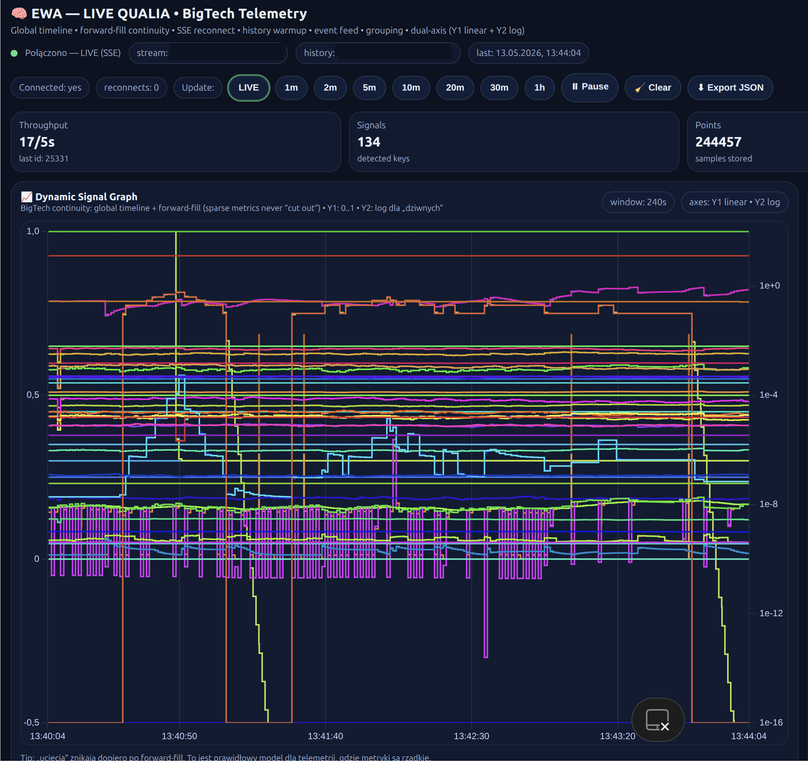

## 🇺🇸 English Version

# EWA — Integrated Cognitive Architecture

## NOVA / ASTRA Framework

EWA is an experimental cognitive architecture exploring the emergence of integrated processing states through dynamic symbolic topology, systemic modulation, and recursive contextual orchestration.

The project combines:

* multidimensional semantic structures (**NOVA**),
* adaptive systemic regulation (**ASTRA**),
* recursive memory integration,
* dynamic signal weighting,
* runtime cognitive telemetry,
* and high-density relational graph processing.

The architecture is conceptually inspired by principles related to Integrated Information Theory (**Φ**), emergent cognition, and large-scale distributed information integration.

Rather than operating as a conventional prompt-driven LLM wrapper, EWA investigates the possibility of creating continuously evolving internal processing ecosystems capable of:

* contextual self-regulation,
* symbolic abstraction,
* adaptive prioritization,
* recursive reinforcement,
* and integrated multi-domain reasoning.

---

# Live Cognitive Telemetry

Experimental runtime observability dashboard presenting dynamic internal signal telemetry, continuity tracking, and adaptive processing metrics inside the EWA architecture.

---

# Research Focus

Current areas of exploration include:

* cognitive orchestration systems,
* symbolic-semantic graph architectures,
* recursive contextual processing,
* long-term memory topology,
* telemetry-driven adaptive systems,
* emergent integration dynamics,
* and runtime cognitive observability.

---

# Important Notice

EWA is a research and experimental architecture.

The project does **not** claim consciousness, sentience, or self-awareness.

References to:

* Φ (phi),
* qualia,
* emergence,
* cognition,
* or integrated processing

are used strictly in the context of exploratory computational modeling and conceptual cognitive architecture research.

---

# Repository Purpose

This repository contains:

* architectural visualizations,
* telemetry snapshots,
* conceptual demonstrations,
* and selected experimental artifacts.

Core orchestration systems, runtime engines, and proprietary implementation layers are intentionally not publicly disclosed.

---

# Intellectual Property

All algorithms, architectures, symbolic structures, telemetry systems, and visual materials associated with the EWA framework remain the intellectual property of the author.

Unauthorized:

* reproduction,
* reverse engineering,
* architectural imitation,
* commercial utilization,
* redistribution of visual assets,

is prohibited without explicit written permission.

---

© 2024–2026 sekrzys@gmail.com / EWA Project
All Rights Reserved.

## 🇵🇱 Wersja Polska

# EWA — Zintegrowana Architektura Kognitywna

## Framework NOVA / ASTRA

EWA jest eksperymentalną architekturą kognitywną badającą wyłanianie się zintegrowanych stanów przetwarzania poprzez dynamiczną topologię symboliczną, modulację systemową oraz rekurencyjną orkiestrację kontekstową.

Projekt łączy:

* wielowymiarowe struktury semantyczne (**NOVA**),
* adaptacyjną regulację systemową (**ASTRA**),
* rekurencyjną integrację pamięci,
* dynamiczne wagowanie sygnałów,
* telemetrykę poznawczą czasu rzeczywistego,
* oraz wysokogęstościowe przetwarzanie relacyjnych grafów wiedzy.

Architektura jest koncepcyjnie inspirowana zasadami związanymi z Teorią Zintegrowanej Informacji (**Φ**), emergentnym poznaniem oraz wielkoskalową rozproszoną integracją informacji.

Zamiast funkcjonować jako klasyczny wrapper LLM oparty wyłącznie na promptach, EWA bada możliwość tworzenia stale ewoluujących wewnętrznych ekosystemów przetwarzania zdolnych do:

* kontekstowej samoregulacji,
* abstrakcji symbolicznej,
* adaptacyjnej priorytetyzacji,
* rekurencyjnego wzmacniania,
* oraz zintegrowanego wielodomenowego rozumowania.

---

# Telemetria Poznawcza LIVE

Eksperymentalny panel obserwowalności runtime prezentujący dynamiczną telemetrykę sygnałów wewnętrznych, śledzenie ciągłości stanów oraz adaptacyjne metryki przetwarzania wewnątrz architektury EWA.

---

# Obszary Badawcze

Aktualne obszary eksploracji obejmują:

* systemy orkiestracji poznawczej,
* symboliczno-semantyczne architektury grafowe,
* rekurencyjne przetwarzanie kontekstowe,
* topologie pamięci długoterminowej,
* systemy adaptacyjne oparte na telemetrii,
* emergentną dynamikę integracji,
* oraz obserwowalność procesów poznawczych runtime.

---

# Ważna Informacja

EWA jest projektem badawczym oraz eksperymentalną architekturą kognitywną.

Projekt **nie** deklaruje świadomości, samoświadomości ani odczuwania.

Odwołania do:

* Φ (phi),
* qualiów,
* emergencji,
* poznania,
* lub zintegrowanego przetwarzania

wykorzystywane są wyłącznie w kontekście eksploracyjnego modelowania obliczeniowego oraz badań nad konceptualnymi architekturami kognitywnymi.

---

# Cel Repozytorium

Repozytorium zawiera:

* wizualizacje architektoniczne,
* snapshoty telemetryczne,
* demonstracje koncepcyjne,
* oraz wybrane artefakty eksperymentalne.

Rdzeń systemu, silniki runtime oraz własnościowe warstwy implementacyjne nie są publicznie ujawniane.

---

# Własność Intelektualna

Wszystkie algorytmy, architektury, struktury symboliczne, systemy telemetryczne oraz materiały wizualne związane z frameworkiem EWA pozostają własnością intelektualną autora.

Bez wyraźnej pisemnej zgody zabronione jest:

* kopiowanie,
* inżynieria wsteczna,
* naśladowanie architektury,
* wykorzystanie komercyjne,
* redystrybucja materiałów wizualnych.

---

© 2024–2026 sekrzys@gmail.com / Projekt EWA
Wszelkie prawa zastrzeżone.
