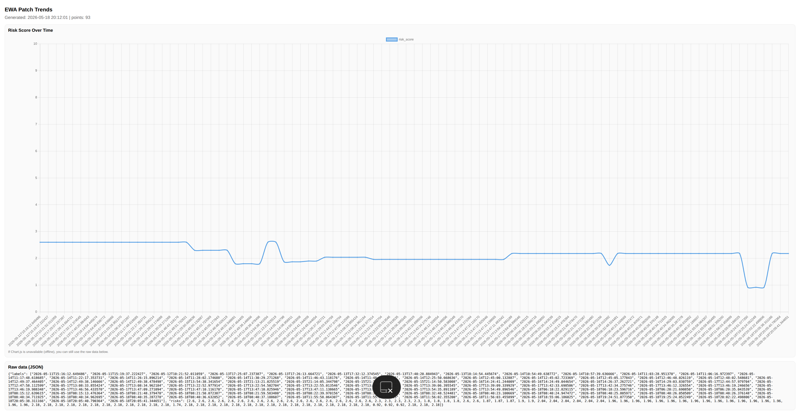

# 🇺🇸 EWA Autonomous Integrity & Runtime Validation Report

## 🤖 Experimental Runtime Integrity Telemetry

The chart below presents sanitized telemetry generated during controlled runtime validation and integrity monitoring cycles 
within the experimental EWA environment.

The visualization represents the abstracted **Risk Score Over Time** metric — a high-level operational stability indicator used 
to observe structural consistency, runtime coherence, adaptive stability, and validation behavior during isolated experimental 
evaluation procedures.

---

## 🔬 Multi-Layer Runtime Validation Environment

The presented telemetry originates from a controlled multi-stage runtime validation environment designed to maintain long-term 
operational consistency, structural stability, and protected integrity supervision inside the local EWA runtime.

Before any experimental runtime adjustment or optimization procedure may proceed further within the environment, it undergoes 
isolated verification, consistency analysis, and protected validation cycles.

The validation environment performs multiple categories of high-level verification, including:

- architectural consistency analysis,
- dependency integrity verification,
- runtime stability evaluation,
- contextual continuity checks,
- operational coherence monitoring,
- isolated sandbox validation procedures,
- controlled integrity supervision routines.

The environment continuously monitors runtime behavior in order to suppress instability, reduce structural anomalies, and 
maintain long-term synchronization consistency across the system.

---

## 📊 Telemetry Interpretation

The visible trend regions on the graph represent different operational states of the validation environment.

### Stable Runtime Region

Values within the stable operational range indicate successful execution of low-risk synchronization and validation procedures 
under controlled runtime conditions.

During these phases the environment maintains:

- operational consistency,
- synchronization stability,
- contextual continuity,
- reduced structural volatility,
- stable runtime coordination.

---

### Consolidation & Stabilization Phases

Temporary local decreases in the metric represent successful stabilization and consolidation periods following controlled 
validation procedures.

These phases are associated with:

- runtime normalization,
- consistency reinforcement,
- reduction of structural variance,
- stabilization of adaptive runtime behavior,
- integrity convergence.

---

### Elevated Risk Detection

Temporary increases in the metric indicate detection of elevated structural uncertainty during isolated experimental 
evaluation cycles.

When increased instability or integrity deviations are detected, the environment automatically activates protective mitigation 
procedures including:

- isolated validation environments,
- protected rollback procedures,
- validation rejection cycles,
- runtime stabilization routines.

Following mitigation, the environment returns to stable operational ranges.

---

## 🛡️ Sanitized Runtime Architecture

The telemetry presented in this repository originates from multiple protected validation and runtime coordination layers 
operating entirely inside a local experimental environment.

Public repository materials intentionally abstract and sanitize implementation-specific runtime mechanisms, orchestration 
logic, synchronization heuristics, optimization strategies, and protected architectural components.

This repository does NOT disclose:

- internal implementation details,
- runtime orchestration topology,
- synchronization mechanisms,
- optimization heuristics,
- protected validation logic,
- execution-layer architecture,
- adaptive coordination internals,
- experimental runtime control mechanisms.

---

> ### 📌 INTEGRITY STATUS: VERIFIED
>
> The telemetry demonstrates stable operation of a controlled local runtime validation environment capable of maintaining 
architectural consistency, protected integrity supervision, and runtime stability during isolated experimental evaluation 
procedures.

---

# 🇵🇱 Raport Integralności i Walidacji Runtime

## 🤖 Eksperymentalna Telemetria Integralności Runtime

Poniższy wykres przedstawia zanonimizowaną telemetrię wygenerowaną podczas kontrolowanych cykli walidacji runtime oraz 
monitorowania integralności w eksperymentalnym środowisku EWA.

Wizualizacja przedstawia abstrakcyjny wskaźnik **Risk Score Over Time** — wysokopoziomowy indeks stabilności operacyjnej 
wykorzystywany do obserwacji spójności strukturalnej, koherencji runtime, stabilności adaptacyjnej oraz zachowania środowiska 
podczas izolowanych eksperymentalnych procedur ewaluacyjnych.

---

## 🔬 Wielowarstwowe Środowisko Walidacji Runtime

Prezentowana telemetria pochodzi z kontrolowanego wieloetapowego środowiska walidacji runtime zaprojektowanego w celu 
utrzymywania długoterminowej spójności operacyjnej, stabilności strukturalnej oraz chronionego nadzoru integralności 
wewnątrz lokalnego środowiska EWA.

Zanim jakakolwiek eksperymentalna procedura optymalizacji lub modyfikacji runtime może zostać dalej przetworzona w środowisku, 
przechodzi przez izolowane cykle weryfikacji, analizy spójności oraz chronionych procedur walidacyjnych.

Środowisko walidacyjne wykonuje wiele kategorii wysokopoziomowej weryfikacji, między innymi:

- analizę spójności architektonicznej,
- weryfikację integralności zależności,
- ocenę stabilności runtime,
- kontrolę ciągłości kontekstowej,
- monitorowanie koherencji operacyjnej,
- izolowane procedury walidacji sandboxowej,
- kontrolowane procedury nadzoru integralności.

Środowisko stale monitoruje zachowanie runtime w celu tłumienia niestabilności, ograniczania anomalii strukturalnych oraz 
utrzymywania długoterminowej spójności synchronizacji całego systemu.

---

## 📊 Interpretacja Telemetrii

Widoczne na wykresie obszary trendów reprezentują różne stany operacyjne środowiska walidacyjnego.

### Stabilny Region Runtime

Wartości mieszczące się w stabilnym zakresie operacyjnym oznaczają poprawne wykonanie niskoryzykownych procedur 
synchronizacji i walidacji w kontrolowanych warunkach runtime.

W trakcie tych faz środowisko utrzymuje:

- spójność operacyjną,
- stabilność synchronizacji,
- ciągłość kontekstową,
- ograniczoną zmienność strukturalną,
- stabilną koordynację runtime.

---

### Fazy Konsolidacji i Stabilizacji

Tymczasowe lokalne spadki wskaźnika reprezentują udane okresy stabilizacji i konsolidacji następujące po kontrolowanych 
procedurach walidacyjnych.

Fazy te związane są między innymi z:

- normalizacją runtime,
- wzmacnianiem spójności,
- redukcją wariancji strukturalnej,
- stabilizacją adaptacyjnego zachowania runtime,
- konwergencją integralności.

---

### Detekcja Podwyższonego Ryzyka

Tymczasowe wzrosty wskaźnika oznaczają wykrycie podwyższonej niepewności strukturalnej podczas izolowanych eksperymentalnych 
cykli ewaluacyjnych.

W przypadku wykrycia zwiększonej niestabilności lub odchyleń integralności środowisko automatycznie aktywuje ochronne 
procedury ograniczania ryzyka, obejmujące między innymi:

- izolowane środowiska walidacyjne,
- chronione procedury rollback,
- cykle odrzucania walidacji,
- mechanizmy stabilizacji runtime.

Po zastosowaniu procedur ochronnych środowisko powraca do stabilnych zakresów operacyjnych.

---

## 🛡️ Zanonimizowana Architektura Runtime

Telemetria prezentowana w repozytorium pochodzi z wielu chronionych warstw walidacji oraz koordynacji runtime działających 
całkowicie wewnątrz lokalnego środowiska eksperymentalnego.

Materiały publicznego repozytorium celowo ukrywają oraz uogólniają implementacyjne mechanizmy runtime, logikę orkiestracji, 
heurystyki synchronizacji, strategie optymalizacyjne oraz chronione komponenty architektoniczne.

Repozytorium NIE ujawnia:

- szczegółów implementacyjnych,
- topologii orkiestracji runtime,
- mechanizmów synchronizacji,
- heurystyk optymalizacyjnych,
- chronionej logiki walidacyjnej,
- architektury warstw wykonawczych,
- mechanizmów adaptacyjnej koordynacji,
- eksperymentalnych mechanizmów kontroli runtime.

---

> ### 📌 STATUS INTEGRALNOŚCI: ZWERYFIKOWANY
>
> Telemetria potwierdza stabilne działanie kontrolowanego lokalnego środowiska walidacji runtime zdolnego do utrzymywania 
spójności architektonicznej, chronionego nadzoru integralności oraz stabilności runtime podczas izolowanych eksperymentalnych 
procedur ewaluacyjnych.

---

📄 Licensing, usage restrictions, telemetry protection, and research usage terms are defined in the repository `LICENSE.md` file.

📄 Warunki licencyjne, ograniczenia wykorzystania, ochrona telemetrii oraz zasady użytkowania materiałów badawczych zostały 
określone w pliku `LICENSE.md`.

---

© 2024–2026 EWA Research Environment
