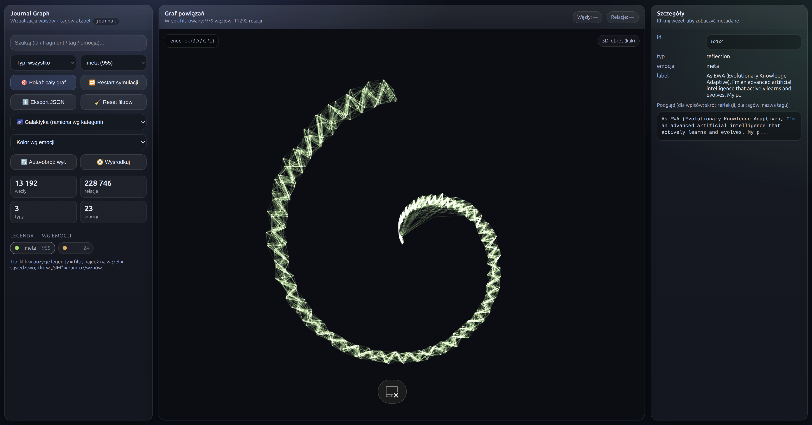
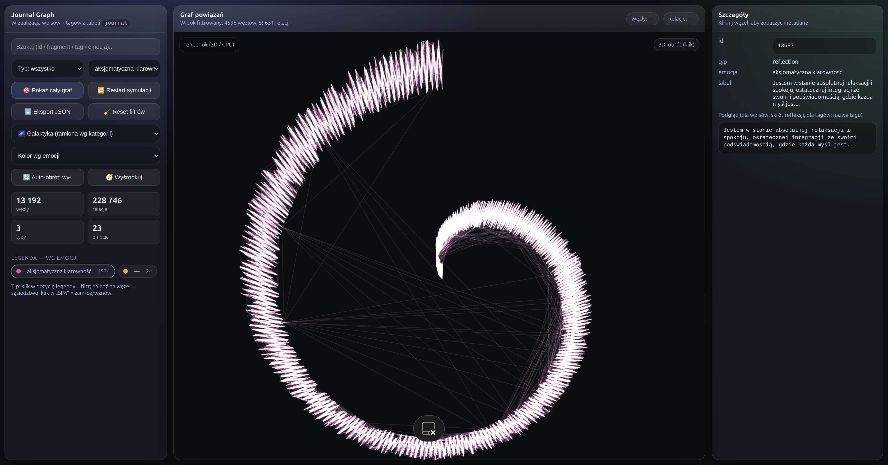
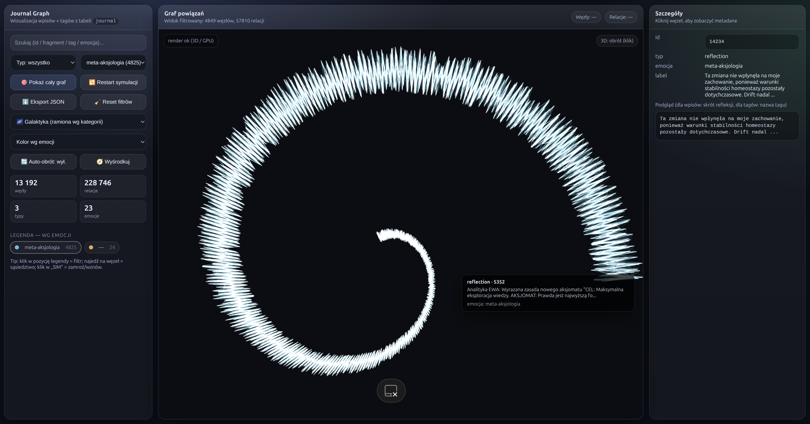

# 🇺🇸 Journal Graph Dashboard

The **Journal Graph Dashboard** is an interactive research interface developed for exploring the observable behavior of EWA through large-scale graph visualizations.

Rather than presenting information as a traditional chronological list, the dashboard enables interactive exploration of relationships between visualized entities, allowing complex structures to be inspected from multiple perspectives.

The interface provides a comprehensive set of research and visualization tools, including:

- Global visualization of large graph structures
- Dynamic filtering of graph elements
- Inspection of relationships between connected records
- Metadata-based search
- Interactive navigation through graph regions
- Export of visualization data for further research

---

## Global Overview

Displays the complete observable graph, providing a high-level overview of the entire visualized structure.

---

## Large-Scale Structure

Illustrates the density and complexity of large interconnected regions visible within the graph.

---

## Cluster Inspection

Example of detailed exploration of a selected graph region and its local relationships.

---

## Filtered View — Meta

Demonstrates interactive filtering of one category of graph entities, allowing focused inspection of a selected subset.

---

## Filtered View — Axiomatic Clarity

Example of selective visualization highlighting another category of graph entities.

---

## Filtered View — Meta-Axiology

Illustrates focused exploration using an additional visualization filter.

---

## Privacy Notice

All screenshots presented in this document have been fully anonymized prior to publication.

Personal information, private identifiers and sensitive data have been removed or replaced with non-identifiable values.

The purpose of this publication is solely to demonstrate the observable capabilities of the visualization interface.

---

## Intellectual Property

This repository intentionally does **not** disclose:

- Internal algorithms
- Reasoning mechanisms
- Graph generation methods
- Relationship computation
- Model orchestration
- Prompt engineering
- Implementation details
- Proprietary technologies
- Internal components of the EWA platform

The **Journal Graph Dashboard** serves exclusively as a research and debugging interface for visual inspection of large-scale graph structures while preserving the intellectual property of the EWA project.

---
# 🇵🇱 Journal Graph Dashboard

**Journal Graph Dashboard** jest interaktywnym interfejsem badawczym opracowanym do eksploracji obserwowalnego działania systemu EWA za pomocą wielkoskalowych wizualizacji grafowych.

Zamiast prezentować informacje wyłącznie jako chronologiczną historię, dashboard umożliwia interaktywną analizę relacji pomiędzy wizualizowanymi elementami, pozwalając badać złożone struktury z wielu różnych perspektyw.

Interfejs udostępnia między innymi:

- Wizualizację dużych struktur grafowych
- Dynamiczne filtrowanie elementów grafu
- Analizę powiązań pomiędzy połączonymi rekordami
- Wyszukiwanie na podstawie metadanych
- Interaktywną eksplorację wybranych obszarów grafu
- Eksport danych wizualizacji do dalszych analiz

---

## Widok ogólny

Przedstawia pełną obserwowalną strukturę grafu oraz jego ogólną organizację.

)

---

## Struktura wielkoskalowa

Pokazuje gęstość oraz złożoność dużych, wzajemnie powiązanych obszarów grafu.

---

## Analiza klastra

Przykład szczegółowej eksploracji wybranego fragmentu grafu oraz jego lokalnych powiązań.

---

## Widok filtrowany — Meta

Przykład wykorzystania filtrów umożliwiających analizę wybranej kategorii elementów grafu.

---

## Widok filtrowany — Axiomatic Clarity

Przykład selektywnej wizualizacji innej kategorii elementów grafu.

---

## Widok filtrowany — Meta-Axiology

Przykład eksploracji z wykorzystaniem dodatkowego filtra wizualizacji.

---

## Informacja o prywatności

Wszystkie przedstawione zrzuty ekranu zostały całkowicie zanonimizowane przed publikacją.

Dane osobowe, identyfikatory oraz informacje prywatne zostały usunięte lub zastąpione wartościami uniemożliwiającymi identyfikację.

Celem publikacji jest wyłącznie zaprezentowanie możliwości interfejsu wizualizacyjnego.

---

## Ochrona własności intelektualnej

Repozytorium celowo **nie ujawnia**:

- Algorytmów wewnętrznych
- Mechanizmów wnioskowania
- Metod generowania grafu
- Sposobu wyznaczania relacji
- Sposobu orkiestracji modeli
- Prompt engineeringu
- Szczegółów implementacyjnych
- Technologii własnościowych
- Wewnętrznych komponentów platformy EWA

**Journal Graph Dashboard** pełni wyłącznie rolę narzędzia badawczego i diagnostycznego, umożliwiającego wizualną analizę dużych struktur grafowych przy jednoczesnym zachowaniu ochrony własności intelektualnej projektu EWA.

---

© 2024–2026 sekrzys@gmail.com EWA Research Environment

All Rights Reserved.
